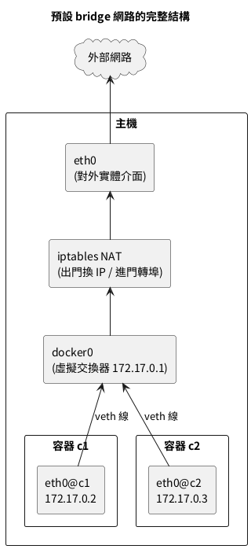

## 回到 Docker：解剖 docker0

Docker 安裝完就自帶一台叫 `docker0` 的交換器，所有沒指定網路的容器都插在它身上。你剛徒手做的五步，對照 Docker 的自動化版本：開容器時建 NET namespace（步驟一）、生一對 veth（步驟三）、一端改名 eth0 塞進容器、另一端插上 docker0（步驟三四）、發一個 172.17 網段的 IP 並把閘道指向 docker0（步驟四）。開兩個容器，把工事現場挖出來對帳：



讀這張圖的三個重點：

- 兩個容器與 docker0 構成一個純內部的二層網段——c1 到 c2 的流量只經過交換器，不碰 NAT、不出主機，這就是容器互連比走外網快的原因。
- NAT 那一格是「國界海關」：只有跨越主機邊界的流量（進門與出門）才過海關，海關規則就是 10.3 與 10.4 節的 MASQUERADE 與 DNAT。
- 圖上每一條線在主機上都有對應的實體可查——這正是接下來對帳指令要做的事。

```bash
# 開兩個觀察標的
docker run -d --name c1 nginx:alpine
docker run -d --name c2 nginx:alpine

# 主機端:看 docker0 這台交換器與它的 IP(它同時是容器們的預設閘道)
ip addr show docker0

# 主機端:交換器上插了哪些線(每個容器一條 veth)
bridge link | grep docker0

# 容器端:各自拿到的 IP 與閘道
docker inspect c1 c2 --format '{{.Name}} → IP: {{.NetworkSettings.IPAddress}} 閘道: {{.NetworkSettings.Gateway}}'

# 對號入座:容器的 eth0 跟主機上哪條 veth 是同一條線的兩端
docker exec c1 cat /sys/class/net/eth0/iflink
ip link | grep -B1 "$(docker exec c1 cat /sys/class/net/eth0/iflink):" | head -1
```

解剖報告逐項說明：

- `docker0` 預設拿 `172.17.0.1/16`：它既是交換器、也是所有容器的預設閘道（容器要出門都先送到它這裡）。
- `bridge link` 列出的 `veth` 開頭介面，每一條對應一個容器——跟你徒手插的 veth1-br、veth2-br 完全同款。
- 對號入座那兩條指令：容器內 `eth0` 的 `iflink` 值是「線另一端在主機上的介面編號」，拿去主機的 `ip link` 清單比對，就能指名道姓說出「c1 的網路線是主機上的 veth 某某」——第 12 章網路除錯的基本功。
- `docker network inspect bridge` 可以看到這張網的完整設定與掛在上面的容器清單，一條指令等於上面全部的摘要版：

```bash
# 這張網的網段、閘道與住戶名冊
docker network inspect bridge --format '網段: {{range .IPAM.Config}}{{.Subnet}}{{end}} | 閘道: {{range .IPAM.Config}}{{.Gateway}}{{end}}'
docker network inspect bridge --format '{{range .Containers}}{{.Name}} → {{.IPv4Address}}{{println}}{{end}}'

# 全機網路盤點:Docker 目前管著哪幾張網
docker network ls
```

- `network ls` 預設列出 bridge、host、none 三張內建網——正好對應本章的三種模式；第 11 章你自己建的網也會出現在這份名冊。
- inspect 的住戶名冊在除錯時是「誰在這張網上」的第一手名單：懷疑兩個容器不同網段互打不通時，先各查一次名冊，同網才有互通的資格——這個習慣帶到第 11 章多網段隔離設計時會天天用。

172.17.0.0/16 這個預設網段跟公司內網撞牌時（VPN 環境的經典災難：連 Docker 主機的路由被容器網段吃掉），在 daemon.json 換掉它：

```bash
# 換掉 docker0 的網段,並指定之後自訂網路的取號範圍
sudo python3 - <<'EOF'
import json
path = "/etc/docker/daemon.json"
cfg = json.load(open(path))
cfg["bip"] = "192.168.200.1/24"
cfg["default-address-pools"] = [{"base": "192.168.201.0/16", "size": 24}]
json.dump(cfg, open(path, "w"), indent=2, ensure_ascii=False)
EOF
sudo systemctl restart docker
ip addr show docker0 | grep inet
```

- `bip` 管 docker0 本人；`default-address-pools` 管之後每張自訂網路從哪個大池子裡切網段、一張切多大（size 24 即每張 /24）。
- 這是「進公司第一天就該查」的設定：撞網段的症狀是 VPN 一開某些內網站就斷，查到瘋掉才發現是 Docker 吃了那段路由。