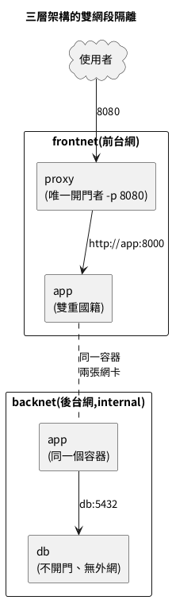

## 實戰：三層架構的網段隔離

把本章武器全部組裝，搭出正規的「前台、後台、資料庫」隔離架構：



讀這張架構圖的三個重點：

- 門只有一扇：proxy 的 8080 是整個系統與外界唯一的接觸面，其餘所有連線都發生在兩張內網裡。
- app 出現兩次但是同一個容器：左右兩格畫的是它的兩張網卡，雙重國籍讓它成為前後台唯一的合法通道。
- db 那格沒有任何往外的箭頭：不開門、無外網，資料層的安全不是靠設定而是靠「路不存在」。

```bash
# 步驟一:兩張網——前台網正常,後台網加 --internal(整網禁止連外)
docker network create frontnet
docker network create --internal backnet

# 步驟二:資料庫只住後台網,不開任何門
docker run -d --name db --network backnet \
  -e POSTGRES_PASSWORD=devpass \
  -v pgdata11:/var/lib/postgresql/data \
  postgres:16-alpine

# 步驟三:應用先入前台網,再 connect 後台網,取得雙重國籍
docker run -d --name app --network frontnet webapp:slim
docker network connect backnet app

# 步驟四:代理只住前台網,而且是全場唯一 -p 開門的人
docker run -d --name proxy --network frontnet -p 8080:80 nginx:alpine

# 驗收一:app 喊得到 db(跨層互通走後台網)
docker exec app python -c "import socket; socket.create_connection(('db', 5432), 3); print('app → db:5432 連線成功')"

# 驗收二:proxy 查無 db(前台網沒有 db 這號人物,隔離成立)
docker exec proxy ping -c 1 -W 1 db 2>&1 | tail -1

# 驗收三:db 連不出外網(--internal 的鐵幕)
docker exec db ping -c 1 -W 2 8.8.8.8 2>&1 | tail -1
```

架構逐項說明：

- **開門原則**：整個系統只有 proxy 一個 `-p`——攻擊面收斂到單點，第 10 章「資料庫裸奔公網」的病從架構上根治，連犯錯的機會都沒有。
- **--internal**：這張網不接 NAT、不給出門的路——資料庫就算被植入惡意程式，也打不了電話回家（外洩管道物理性切斷），是後場網的標配。
- **app 的雙重國籍**是三層架構的樞紐：前台收 proxy 的流量、後台連 db，兩個世界只在它身上交會。
- 驗收三連發對應三條架構承諾：該通的通、不該見的查無此人、後場出不了門——每條承諾都有指令輸出當證據，這就是「架構圖不只是圖」的意思。 proxy 目前只是站在門口，讓它真的把流量轉給 app，端到端走完最後一哩：

```bash
# 寫一份反向代理設定:8080 進來的請求,轉給後面的 app(用名字!)
mkdir -p ~/proxy-conf
cat > ~/proxy-conf/default.conf <<'EOF'
server {
    listen 80;
    location / {
        proxy_pass http://app:8000;
        proxy_set_header Host $host;
        proxy_set_header X-Real-IP $remote_addr;
    }
}
EOF

# 重建 proxy,把設定唯讀掛進去(第 09 章的單檔掛載手法)
docker rm -f proxy
docker run -d --name proxy --network frontnet -p 8080:80   -v ~/proxy-conf/default.conf:/etc/nginx/conf.d/default.conf:ro   nginx:alpine

# 端到端驗收:使用者 → proxy → app,一路走通
curl -s http://localhost:8080/healthz
curl -s http://localhost:8080/ | head -1
```

端到端逐項說明：

- `proxy_pass http://app:8000`：轉發目標寫的是**容器名**——本章 DNS 的價值在生產設定檔裡的落點就是這一行。app 重啟、換 IP、換版本，這份設定一個字都不用動。
    
- 兩個 proxy_set_header 把原始請求的主機名與來源 IP 傳給後端，app 的日誌才看得到真實訪客而不是滿版的 proxy 內網 IP——反向代理的基本禮儀，第 22 章負載平衡會擴充成完整套件。
    
- 驗收打的是 8080（proxy 的門），回應卻來自 app 的 FastAPI——流量完整走過「使用者 → 前台網 → 雙籍樞紐 → 後台網」的設計路徑，三層架構正式活起來。
    
- 眼尖的話你會發現：這一整段手工，就是第 13 章 Compose 檔十幾行宣告的展開版。先苦後甘，Compose 學起來才不是黑魔法。
    