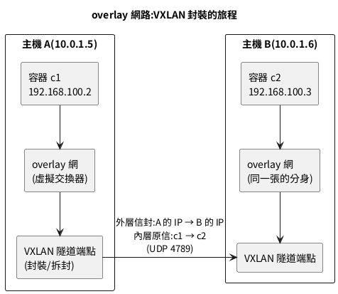

## overlay：讓一百台主機看起來像一台交換器

### 原理先懂：VXLAN 封裝

單機時代 veth 插 bridge 就通了；跨主機時，容器的私有網段封包沒辦法直接在機房網路上跑。overlay 的解法是**套信封**：



封裝旅程逐項說明：

- c1 寄給 c2 的封包（內層原信）在離開主機 A 之前，被**整封塞進一個新的 UDP 封包**（外層信封），信封上寫的是「主機 A 寄給主機 B」——機房網路只看得懂主機層級的位址，照常投遞。
- 主機 B 收到後拆信封，把原信丟進本機的 overlay 交換器，c2 收信——**兩端容器全程不知道中間跨過了實體網路**。
- 封裝走 UDP 4789（VXLAN 標準埠）；控制面（誰在哪台主機、名冊同步）由 Swarm 的管理機制負責——所以 overlay 需要 Swarm 模式當地基。
- 素材裡整整兩章的 Weave Net 與 Flannel 是同一個問題的第三方老解法，**在 Docker 情境已被內建 overlay 取代**（Kubernetes 情境則由 CNI 外掛生態接手），細節列入附錄 A 考古區，這裡專心練內建正解。

### 單機也能開練：attachable overlay

跨主機的完整叢集留給第 23 章，但 overlay 的操作手感現在就能建立——單節點 Swarm 一樣能開 overlay 網：

```bash
# 步驟一:把本機升級成單節點 Swarm(一條指令,不影響既有容器)
docker swarm init 2>/dev/null || true

# 步驟二:開一張 overlay 網,--attachable 允許一般容器(非 Swarm 服務)加入
docker network create -d overlay --attachable --subnet 192.168.100.0/24 meshnet

# 步驟三:兩個一般容器掛上去,名稱互通照舊
docker run -d --name mesh1 --network meshnet nginx:alpine
docker run -d --name mesh2 --network meshnet alpine sleep 600
docker exec mesh2 ping -c 2 mesh1

# 步驟四:看這張網的驅動與屬性——與 bridge 網的差異一目了然
docker network inspect meshnet --format '驅動: {{.Driver}} | 網段: {{range .IPAM.Config}}{{.Subnet}}{{end}} | 可附掛: {{.Attachable}}'

# 步驟五:主機端找 overlay 的痕跡(隧道端點藏在 Docker 私有的 netns 裡)
sudo ls /run/docker/netns/ | head -5
```

單機演練逐項說明：

- `swarm init`：本章只借它的「控制面」讓 overlay 能運作，Swarm 本體（服務、副本、跨節點調度）是第 23 章的主菜——先租場地、之後才辦活動。
- `--attachable`：預設 overlay 只給 Swarm 服務用，加了這個旗標，`docker run --network` 的一般容器也能上車——開發與混合部署的常用姿勢。
- 名稱解析、別名、connect 熱插拔，第 11 章那套在 overlay 上**原封不動全部適用**——這是 Docker 網路模型漂亮的地方：換驅動不換操作習慣。親手驗證這句話：

```bash
# overlay 上照樣熱掛第二張網、照樣用別名——第 11 章的技能無縫轉移
docker network create -d overlay --attachable meshnet2
docker network connect --alias backup meshnet2 mesh2
docker run --rm --network meshnet2 alpine nslookup backup 2>/dev/null | tail -2
docker network disconnect meshnet2 mesh2 && docker network rm meshnet2
```

- 唯一的差異在你看不見的底層：bridge 走本機 veth、overlay 走 VXLAN 隧道；操作介面完全一致，這正是「先學單機、無痛升級多機」的底氣。
- `/run/docker/netns/` 底下是 Docker 私藏的網路世界（含 overlay 隧道端點），第 10 章的 `ip netns list` 看不到它們，因為 Docker 沒登記到標準位置——要進去看用 `sudo nsenter --net=/run/docker/netns/<檔名> ip addr`，除錯進階武器，備而不用。
- 敏感環境的加密選項：`docker network create -d overlay --opt encrypted securenet` 讓跨主機的 VXLAN 流量走 IPSec——代價是吞吐下降，內網可信環境通常不開、跨機房必開。
- overlay 的隱形殺手是 MTU：VXLAN 每個封包多背 50 位元組信封，若底層網路 MTU 卡死 1500，大封包會被切割甚至丟棄，症狀是「小請求正常、大檔案傳輸卡死」。跨機房 overlay 遇到這種怪病，先查兩端實體網路的 MTU 是否一致、overlay 網的 `--opt com.docker.network.driver.mtu` 有沒有留足信封空間——這是第 23 章多機實戰的高頻疑難雜症，先埋個雷達。

overlay 與 bridge 在「名冊」上的機制差異，先建立正確期待：

- bridge 的 DNS 名冊只有一台主機要管，daemon 自己記自己查；overlay 的名冊要**跨主機同步**——哪個名字在哪台主機的哪個 IP，靠 Swarm 控制面的分散式儲存傳遞，7946 埠傳的就是這些八卦。
- 同步是最終一致的：新容器上線到「全叢集都查得到它」有極短的傳播時間，寫壓力測試腳本時別在容器誕生的同一毫秒就期待名字全網可解。
- 第 23 章 Swarm 服務還會在這套名冊上加一層**虛擬 IP**（一個服務名對一個 VIP，後面自動負載分擔）——比第 11 章 DNS 輪替高一個檔次，這裡先預告，屆時回收。