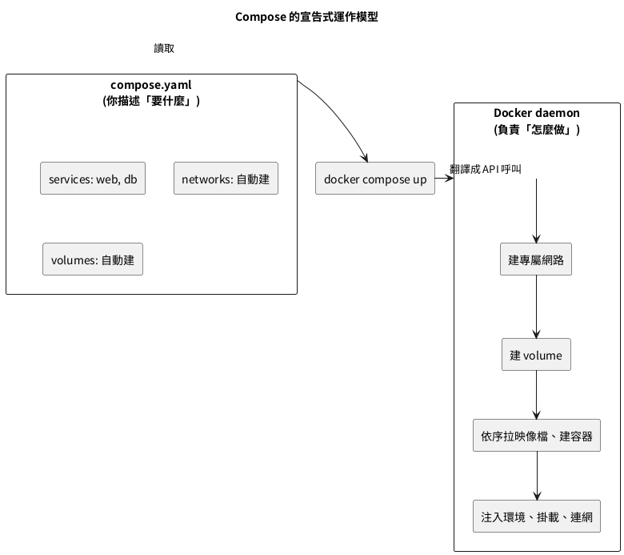

## 13.1 為什麼需要 Compose：先看痛在哪

先把第 11 章的手工流程攤開，數一數要打幾條指令才能起一套「Web + 資料庫」：

```bash
# 手工起一套系統要做的事(第 11 章的濃縮版)
docker network create appnet                              # 建網
docker volume create pgdata                               # 建 volume
docker run -d --name db --network appnet \
  -e POSTGRES_PASSWORD=devpass \
  -v pgdata:/var/lib/postgresql/data postgres:16-alpine   # 起資料庫
docker run -d --name web --network appnet \
  -e DATABASE_URL=postgresql://postgres:devpass@db:5432/postgres \
  -p 8000:8000 webapp:slim                                # 起 Web
```

指令逐項說明：

1. 第一條建自訂網路，讓容器能用名字互找（第 11 章的 DNS）。
2. 第二條建具名 volume，讓資料庫資料活得比容器久（第 09 章的保命符）。
3. 第三條起資料庫，掛網、掛 volume、注入密碼。
4. 第四條起 Web，掛同一張網、用名字 `db` 連資料庫、開對外埠。

四條指令、四個要記住的參數對應關係，而且——**這些狀態全在你腦袋和 shell 歷史裡，沒進版本控制、換台機器就要重打、交接給同事要寫一頁文件**。這就是痛點。Compose 把這四條指令變成一份檔案，痛點一次解決。

---

## Compose 的運作模型



三個關鍵觀念先建立：

- **宣告式 vs 命令式**：`docker run` 是命令式（你下一步一步的指令）；Compose 是宣告式（你描述最終狀態，工具算出該做什麼）。改一個設定重新 `up`，Compose 只動有變的部分，沒變的容器不重建。
- **一個專案一個命名空間**：Compose 用「專案名」（預設是資料夾名）當前綴，自動幫網路、volume、容器命名並隔離，不同專案互不干擾。
- **服務（service）不是容器**：一個 service 可以擴充成多個容器副本（第 14 章的 `--scale`），service 是「你要跑什麼」的邏輯單位，容器是它的實體。

還有一個容易踩的歷史包袱要先講清楚——**指令的新舊寫法**：

- 老教材寫的是 `docker-compose`（中間有連字號），那是獨立安裝的 Python 版工具（Compose v1），已經停止維護。
- 現行標準是 `docker compose`（中間空格），它是 Docker CLI 的內建外掛（Compose v2，第 02 章五件套之一），用 Go 重寫、速度更快、與 Docker 本體整合。
- 兩者的 YAML 檔絕大多數相容，但指令一律用**空格版**。看到教材寫連字號版，自動翻譯成空格版即可——這跟第 10 章把 ifconfig 翻成 ip 是同一種「讀舊書的基本功」。