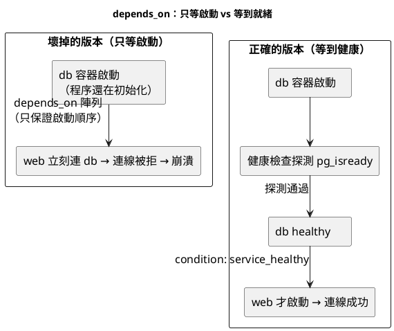

## condition：讓 web 真的等到 db 就緒

有了健康檢查，`depends_on` 就能升級成「等到健康才放行」——這是本章的核心解法。先用一張圖看清「壞掉的順序」與「正確的就緒編排」差在哪：



讀圖重點三條：

- 左邊壞在「箭頭只代表啟動先後」——db 容器一起來 web 就衝，撞上初始化空窗。
- 右邊多了「探測 → healthy」這一段，web 的箭頭從「db 啟動」改接到「db healthy」——等待的目標從容器變成服務。
- 這張圖就是 14.1 節那個坑的解法圖解，接下來的 YAML 把它變成可執行的設定。

```yaml
# compose.yaml：depends_on 升級版,等 db 健康才起 web
services:
  db:
    image: postgres:16-alpine
    environment:
      POSTGRES_PASSWORD: ${POSTGRES_PASSWORD}
      POSTGRES_DB: ${POSTGRES_DB}
    volumes:
      - pgdata:/var/lib/postgresql/data
    healthcheck:
      test: ["CMD-SHELL", "pg_isready -U postgres -d ${POSTGRES_DB}"]
      interval: 5s
      timeout: 3s
      retries: 5
      start_period: 10s
    networks: [backend]

  cache:
    image: redis:7-alpine
    healthcheck:
      test: ["CMD", "redis-cli", "ping"]   # Redis 的就緒探測:回 PONG 即健康
      interval: 5s
      timeout: 3s
      retries: 5
    networks: [backend]

  web:
    build: .
    ports:
      - "${WEB_PORT:-8000}:8000"
    environment:
      DATABASE_URL: postgresql://postgres:${POSTGRES_PASSWORD}@db:5432/${POSTGRES_DB}
      REDIS_HOST: cache
    depends_on:
      db:
        condition: service_healthy    # 等 db 健康(不只是啟動)
      cache:
        condition: service_healthy    # 等 cache 健康
    networks: [backend]

networks:
  backend:
    driver: bridge

volumes:
  pgdata:
```

升級的關鍵逐項說明：

1. `depends_on` 從「陣列寫法」（只列服務名）升級成「物件寫法」（服務名 + condition）——這是解決 14.1 節坑的正解。
2. `condition: service_healthy`：web 會**等到 db 的健康檢查通過**才啟動，不再是容器一起來就搶連線。db 必須先定義 healthcheck，這個條件才有意義。
3. 另外兩種 condition 值：`service_started`（等同舊的陣列寫法，只等啟動）、`service_completed_successfully`（等某個一次性任務容器成功跑完再起——資料庫遷移、初始化腳本的編排靠它）。
4. cache 也加了健康檢查與被依賴，web 同時等 db 與 cache 兩者健康——多依賴的就緒編排，Compose 幫你同時等待、全部就緒才放行。

驗證「等待就緒」真的生效：

```bash
# 完整起系統,觀察啟動順序:db/cache 先健康,web 才開始
docker compose up -d

# 看事件時間軸:web 的建立時間晚於 db/cache 變 healthy 的時間
docker compose ps --format 'table {{.Name}}\t{{.Status}}'

# 直接進 web 驗證它啟動時 db 已可連(不再噴 14.1 的錯誤)
docker compose logs web | tail -3
curl -s http://localhost:8000/ | python3 -m json.tool

docker compose down
```

- 這次 web 的日誌乾乾淨淨、沒有連線失敗——因為它是等 db 與 cache 都掛上 healthy 才啟動的，14.1 節的啟動風暴被 `service_healthy` 徹底馴服。
- 對比 14.1 節的 `compose.broken.yaml`：同樣的依賴關係，差別只在「有沒有健康檢查 + service_healthy」——這一組合就是有狀態服務編排的標準答案。

還有一個部署時超好用的旗標——`--wait`，讓 up 指令本身等到全部健康才返回：

```bash
# --wait:up 會阻塞直到所有帶健康檢查的服務都 healthy 才返回
# 適合 CI/部署腳本:這條指令成功 = 整套系統就緒(第 16 章的部署判準)
docker compose up -d --wait

# 若有服務在逾時內沒健康,--wait 會以非零結束碼失敗——部署腳本據此判定成敗
echo "up --wait 結束碼: $?"

# 搭配 --wait-timeout 設定最長等待秒數,避免無限等待
docker compose down && docker compose up -d --wait --wait-timeout 60
docker compose down
```

- `--wait` 把「整套系統就緒」變成一個可以用結束碼判斷的事件：0 代表全部健康、非 0 代表有服務沒起來——CI 流水線靠這個判斷「部署成功了嗎」，不必自己輪詢狀態。
- `--wait-timeout` 是保險絲：某服務永遠健康不了時，別讓部署腳本卡死，逾時就失敗、觸發回滾。
